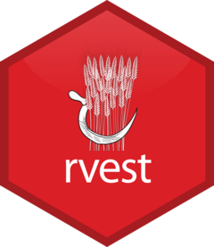

# Objective

**Get Familiar with `rvest`**: Learn how to use **`rvest`** to easily grab information from websites. We'll cover the main tools in **`rvest`** that help us read and collect data from web pages, including data from tables and images.

# 1- Install rvest {width="58" height="61"}

First, we need to install the package "rvest". Its also included in the "tidyverse".

```{r}
# install.packages("rvest")
```

For this tutorial we also need the package `formattable` and `httr`

```{r}
# install.packages("formattable")
# install.packages("httr")
```

Now, import the library:

```{r}
library(rvest)
library(formattable)
library(httr)
```

# `rvest` basic tutorial

The next example comes from the rvest website (Obtained from: <https://rvest.tidyverse.org/index.html>). This shows us the basic functionality of the package to read html, retrieve information from specific html elements and attributes and how to convert html to text.

```{r}

# Start by reading a HTML page with read_html():
starwars <- read_html("https://rvest.tidyverse.org/articles/starwars.html")

# Then find elements that match a css selector or XPath expression
# using html_elements(). In this example, each <section> corresponds
# to a different film
films <- starwars %>% html_elements("section")
films

# Then use html_element() to extract one element per film. Here
# we the title is given by the text inside <h2>
title <- films %>% 
  html_element("h2") %>% 
  html_text2()
title

# Or use html_attr() to get data out of attributes. html_attr() always
# returns a string so we convert it to an integer using a readr function
episode <- films %>% 
  html_element("h2") %>% 
  html_attr("data-id") %>% 
  readr::parse_integer()
episode
```

# Web scraping from tables

The next one is an example that I developed in order to learn how to extract information from a webpage of the Global Monitoring Laboratory from NOAA. The website that we will scrap is: <https://gml.noaa.gov/ccgg/about/co2_measurements.html>

## How to identify elements

In this case we can observe the elements of the html with the developer tools of Google Chrome. With this information we can identify the elements that we want to read and call them inside the `rvest` library. 

{width="712" height="362"}

## Scraping and Displaying '.container' Elements in R

The given R code reads the HTML content of the webpage at "https://gml.noaa.gov/ccgg/about/co2_measurements.html" using `read_html`, then selects elements with the class ".container" using `html_elements` from the `rvest` package, and finally displays the content of these elements.

```{r}
html <- read_html("https://gml.noaa.gov/ccgg/about/co2_measurements.html")

view <- html %>% html_elements(".container")
view

```
## Extracting and Displaying the First HTML Table in R
The next R code extracts the first HTML table found on the previously read webpage and converts it into a data frame, then displays the contents of this table.

```{r}
table <- html %>% 
  html_element("table") %>% 
  html_table()
  
table
```
## Formatting a Scraped HTML Table with Custom Styles in R

The next R script first loads the `formattable` library, then extracts an HTML table from a webpage and converts it into a data frame, renames the empty column name to "Measure," and applies custom formatting to the table using the `formattable` package, including color styling for specific columns and text styling for the "Measure" column.

```{r}

library(formattable)

table <- as.data.frame(html %>% 
  html_element("table") %>% 
  html_table())

# Inspect the table
head(table)

names(table)[names(table) == ""] <- "Measure"  # Replace 'new_column_name' with a suitable name

colnames(table)

# Define your custom colors
customGreen = "#71CA97"
customGreen0 <- "#DFF0D8"

formattable(table, align = c("l", "r", "r"), list(
  `Measure` = formatter("span", style = ~ style(color = "grey", font.weight = "bold")),
  `dry air` = color_tile(customGreen0, customGreen),
  `3% wet air` = color_tile(customGreen0, customGreen)
))


```

# Web scrap images

The next R script uses the `rvest` and `httr` libraries to scrape and download images from the NOAA website. It first reads the HTML content of the specified URL, then selects and extracts the image URLs contained within `<figure>` and `<a>` tags. After ensuring the target directory for saving images exists, it downloads each image to that directory.

```{r}

url <- "https://gml.noaa.gov/ccgg/about/co2_measurements.html"

page <- read_html(url)

# Locate the figure nodes
figure_nodes <- html_nodes(page, "figure > a")  # Adjust the CSS selector as needed

# Extract the URLs from href attribute
image_urls <- html_attr(figure_nodes, "href")

image_urls

# Directory to save images
save_directory <- "scrap_images"  # Replace with your desired directory

# Create the directory if it doesn't exist
if(!dir.exists(save_directory)) {
  dir.create(save_directory, recursive = TRUE)
}

lapply(image_urls, function(url) {
    if(!is.na(url) && url != "") {
        full_url <- URLencode(ifelse(startsWith(url, "http"), url, paste0("https://gml.noaa.gov/ccgg/about/", url)))
        image_name <- basename(url)
        image_path <- file.path(save_directory, image_name)

        GET(full_url, write_disk(image_path, overwrite = TRUE))
    }
})

```
